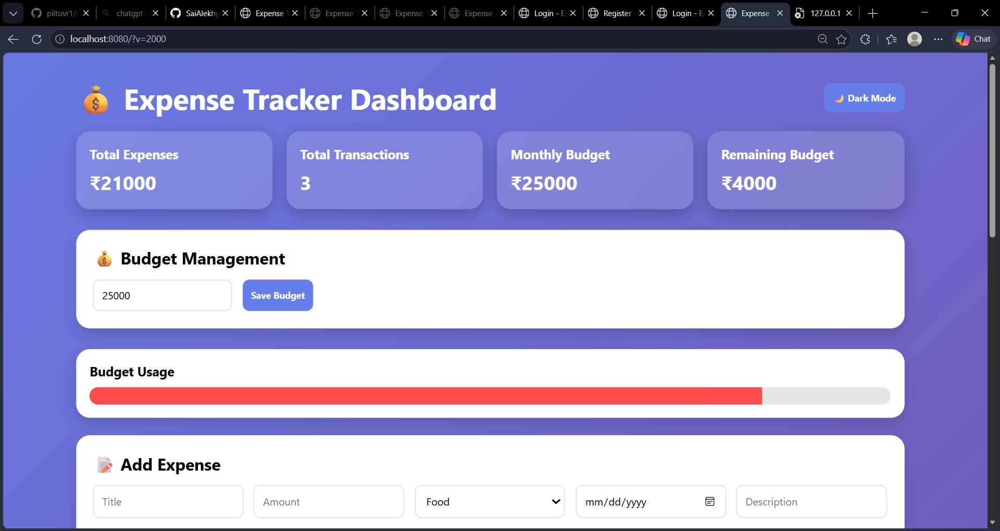
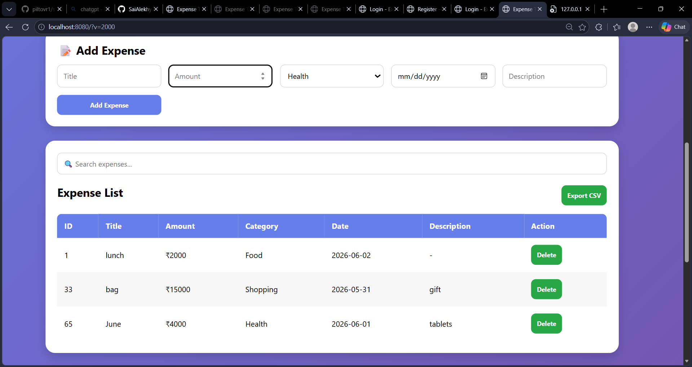
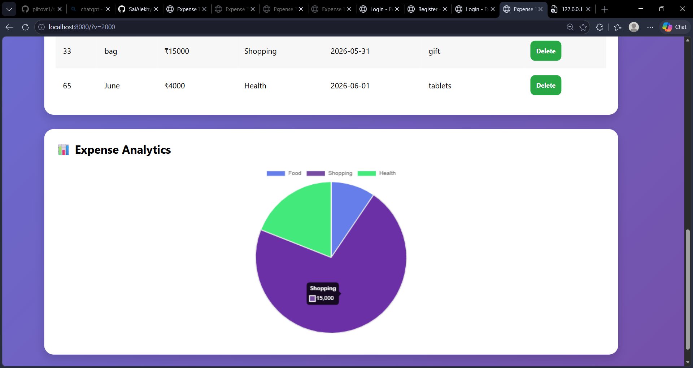

# 💰 Expense Tracker Dashboard

A full-stack Expense Tracker application built using Java, Spring Boot, Spring Data JPA, H2 Database, HTML, CSS, JavaScript, and Chart.js.

## Features

* Add Expenses
* View Expenses
* Delete Expenses
* Budget Management
* Budget Progress Tracking
* Expense Analytics Dashboard
* Pie Chart Visualization using Chart.js
* Search Expenses
* Export Expenses to CSV
* Dark Mode Support
* Responsive User Interface
* REST API Integration

## Screenshots

### Dashboard



### Expense List



### Analytics



## Tech Stack

### Backend

* Java
* Spring Boot
* Spring Data JPA
* H2 Database
* Maven

### Frontend

* HTML
* CSS
* JavaScript
* Chart.js

### Version Control

* Git
* GitHub

## API Endpoints

### Get All Expenses

```http
GET /api/expenses
```

### Add Expense

```http
POST /api/expenses
```

### Update Expense

```http
PUT /api/expenses/{id}
```

### Delete Expense

```http
DELETE /api/expenses/{id}
```

## Future Enhancements

* User Authentication
* PostgreSQL Integration
* Cloud Deployment
* Monthly Expense Reports

## Author

Yadlapalli Sai Alekhya

B.Tech – Artificial Intelligence and Data Science

Shri Vishnu Engineering College for Women
